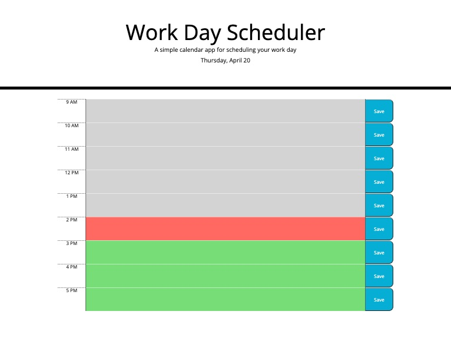

# Day Brain

## Description

A simple work day scheduling application

## Installation

N/A

## Usage

Enter the task or event you would like to schedule in the appropriate times text block. Click the save button. Your schedule will be saved in local storage. If you choose to change a task or event, just replace the text with your new entry and click save. The hour blocks are color coded in gray, red, and green for past, present and future respectively.

Link to deployed page: https://neilmkflyingk.github.io/day-brain/

## Credits

Starter code for this project was provided and can be seen at assets/source.

## License

Please refer to the license listed in the GitHub repository.

